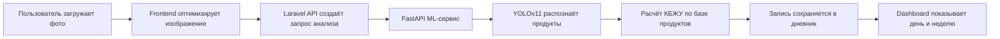

<div align="center">
  

  <h1>NutriVision</h1>

  <p>
    <strong>AI-дневник питания:</strong> фото блюда → распознавание продуктов → уточнение порций → расчёт КБЖУ.
  </p>

  <p>
    
    
    
    
    
  </p>
</div>

---

## ✨ Идея проекта

**NutriVision** помогает пользователю вести дневник питания без ручного ввода каждого продукта. Пользователь загружает фото блюда, ML-сервис распознаёт продукты, backend сохраняет запись, а frontend показывает дневной и недельный баланс КБЖУ.

Проект состоит из трёх частей:

```text
NutritionProject/
├── README.md              # общий README проекта
├── web/                   # Laravel API + Vue frontend
│   └── README.md
├── ml_api/                # FastAPI inference service
│   └── README.md
└── ml_training/           # обучение/эксперименты YOLO
    └── README.md
```

---

## 🎬 Как работает NutriVision



---

## 🧩 Архитектура

| Слой | Технологии | Назначение |
|---|---|---|
| Frontend | Vue 3, Vite, Pinia, Vue Router | UI, дневник питания, профиль, авторизация |
| Backend | Laravel, Sanctum, Policies, Resources | REST API, auth, записи питания, продукты, Cloudinary |
| ML API | FastAPI, ONNX Runtime, YOLOv11 | Распознавание продуктов и расчёт нутриентов |
| ML Training | Ultralytics YOLO, Python notebooks/scripts | Подготовка датасета, обучение и экспорт модели |

---

## 🚀 Быстрый старт

### 1. Клонировать проект

```bash
git clone <repository-url> NutritionProject
cd NutritionProject
```

### 2. Запустить web-часть

Подробно: [`web/README.md`](web/README.md)

```bash
cd web/backend
composer install
cp .env.example .env
php artisan key:generate
php artisan migrate --seed
php artisan serve
```

```bash
cd ../frontend
npm install
npm run dev
```

### 3. Запустить ML API

Подробно: [`ml_api/README.md`](ml_api/README.md)

```bash
cd ml_api
python -m venv .venv
source .venv/bin/activate  # Windows: .venv\Scripts\activate
pip install -r requirements.txt
uvicorn api.app:app --host 0.0.0.0 --port 8000 --reload
```

---

## 🔐 Основные возможности

- регистрация и вход пользователя;
- первичная настройка профиля и дневных целей;
- расчёт индивидуальной нормы калорий, белков, жиров и углеводов;
- загрузка фото блюда;
- оптимизация изображения перед отправкой;
- распознавание продуктов через ML-сервис;
- ручное добавление продуктов;
- редактирование состава и веса порций;
- дневная сводка КБЖУ;
- недельная статистика питания;
- тёмная и светлая тема;
- авто-logout при истёкшем токене;
- защита маршрутов через Vue Router.

---

## 🗂️ Основные директории

```text
web/
├── backend/               # Laravel API
└── frontend/              # Vue приложение

ml_api/
├── api/                   # FastAPI приложение
├── data/                  # база продуктов и КБЖУ
└── models/                # ONNX/YOLO модели

ml_training/
├── datasets/              # датасеты, если используются локально
├── notebooks/             # эксперименты
├── runs/                  # результаты обучения
└── scripts/               # вспомогательные скрипты
```

---

## ⚙️ Переменные окружения

### Frontend

```env
VITE_API_URL=http://localhost:8000/api
VITE_ML_URL=http://localhost:8000
```

### Backend

```env
APP_URL=http://localhost:8000
FRONTEND_URL=http://localhost:5173
CLOUDINARY_URL=cloudinary://...
```

### ML API

```env
MODEL_PATH=models/best.onnx
NUTRITION_DB_PATH=data/nutrition_products_ru_kbju_100g.json
```

---

## ✅ Проверка перед демонстрацией

```bash
cd web/frontend
npm run build
```

```bash
cd web/backend
php artisan test
```

```bash
cd ml_api
python -m compileall api
```

Ручной smoke-test:

- регистрация;
- первичная настройка профиля;
- вход/выход;
- загрузка фото;
- ручное добавление продукта;
- редактирование веса продукта;
- удаление записи;
- обновление страницы с активным token;
- переход на защищённые страницы без token.

---

## 🧭 Документация модулей

- [`web/README.md`](web/README.md) — Laravel backend и Vue frontend.
- [`ml_api/README.md`](ml_api/README.md) — FastAPI inference service.
- [`ml_training/README.md`](ml_training/README.md) — обучение и экспорт модели.

---

## 👤 Автор

**Oleg Brazhenko**  
AI / Web / Full-stack project

---

<div align="center">
  <strong>NutriVision</strong><br />
  <span>From food image to nutrition insight.</span>
</div>
