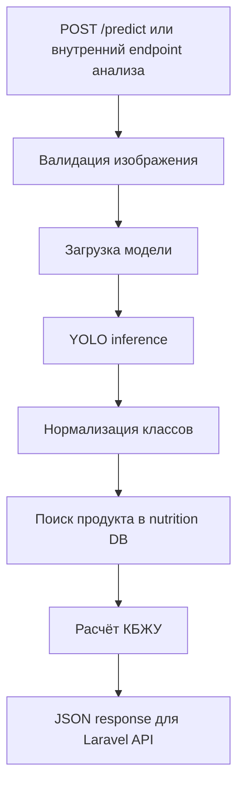

<div align="center">
  <h1>NutriVision ML API</h1>

  <p>
    <strong>FastAPI inference service</strong> для распознавания продуктов и расчёта КБЖУ.
  </p>

  <p>
    
    
    
    
  </p>
</div>

---

## 📌 Назначение

`ml_api` — отдельный ML-сервис NutriVision. Он принимает изображение блюда, выполняет inference модели распознавания продуктов и возвращает структурированный результат для Laravel backend.

```text
ml_api/
├── README.md
├── api/
│   └── app.py
├── data/
│   └── nutrition_products_ru_kbju_100g.json
├── models/
│   └── .gitkeep
└── requirements.txt
```

---

## 🎬 Inference-flow



---

## 🚀 Локальный запуск

```bash
cd ml_api
python -m venv .venv
```

### Windows

```powershell
.venv\Scripts\activate
pip install -r requirements.txt
uvicorn api.app:app --host 0.0.0.0 --port 8000 --reload
```

### macOS / Linux

```bash
source .venv/bin/activate
pip install -r requirements.txt
uvicorn api.app:app --host 0.0.0.0 --port 8000 --reload
```

После запуска сервис будет доступен по адресу:

```text
http://localhost:8000
```

---

## ⚙️ Переменные окружения

Если в проекте используются `.env` параметры, рекомендуется такая структура:

```env
MODEL_PATH=models/best.onnx
NUTRITION_DB_PATH=data/nutrition_products_ru_kbju_100g.json
CONFIDENCE_THRESHOLD=0.25
```

Фактические имена переменных должны соответствовать `api/app.py`.

---

## 🧠 Модель

ML API рассчитан на использование экспортированной YOLO-модели, например:

```text
models/best.onnx
```

Файл модели обычно не хранится в Git, потому что может быть большим. Для репозитория лучше оставить:

```text
models/.gitkeep
```

А саму модель передавать отдельно или загружать на сервер при деплое.

---

## 🥗 База продуктов

Файл:

```text
data/nutrition_products_ru_kbju_100g.json
```

Обычно содержит соответствие между классом модели и пищевой ценностью продукта на 100 г:

```json
{
  "class_name": "apple",
  "name_ru": "Яблоко",
  "kcal": 52,
  "protein": 0.3,
  "fat": 0.2,
  "carbs": 14
}
```

Backend использует результат ML API, чтобы создать запись анализа и пересчитать КБЖУ с учётом веса порции.

---

## 🔌 Интеграция с Laravel

Laravel backend обращается к ML API во время анализа фото.

Рекомендуемая настройка backend `.env`:

```env
ML_SERVICE_URL=http://localhost:8000
```

В production URL должен указывать на размещённый ML-сервис.

---

## 🩺 Health и warm-up

Для production желательно иметь endpoint прогрева, например:

```text
POST /warmup
```

Он нужен, чтобы frontend/backend могли заранее разбудить ML-сервис на бесплатном хостинге.

Также полезны endpoints:

```text
GET /health
GET /
```

---

## 🧪 Проверка

Минимальная проверка Python-кода:

```bash
python -m compileall api
```

Проверка запуска:

```bash
uvicorn api.app:app --host 0.0.0.0 --port 8000 --reload
```

Проверка health endpoint:

```bash
curl http://localhost:8000/health
```

---

## 📦 Деплой notes

- Убедитесь, что модель доступна по `MODEL_PATH`.
- Проверьте размер модели и лимиты хостинга.
- Для Render/free-tier учитывайте холодный старт.
- Добавьте warm-up endpoint, если сервис засыпает.
- Не храните большие веса модели в Git без необходимости.

---

<div align="center">
  <strong>NutriVision ML API</strong><br />
  <span>Food detection service for nutrition intelligence.</span>
</div>
