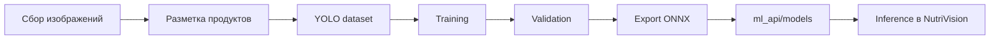

<div align="center">
  <h1>NutriVision ML Training</h1>

  <p>
    <strong>Обучение, эксперименты и экспорт YOLO-модели</strong> для распознавания продуктов.
  </p>

  <p>
    
    
    
    
  </p>
</div>

---

## 📌 Назначение

`ml_training` — рабочая зона для обучения модели NutriVision. Здесь можно хранить ноутбуки, скрипты, конфиги датасетов, результаты экспериментов и экспортированные модели.

```text
ml_training/
├── README.md
├── notebooks/          # Jupyter/Colab эксперименты
├── scripts/            # вспомогательные скрипты
├── datasets/           # локальные датасеты, обычно не коммитятся
├── runs/               # результаты обучения YOLO, обычно не коммитятся
└── exports/            # экспортированные модели, если нужны локально
```

Если некоторых папок нет, их можно создать по мере необходимости.

---

## 🎬 Training pipeline



---

## 🚀 Подготовка окружения

```bash
cd ml_training
python -m venv .venv
```

### Windows

```powershell
.venv\Scripts\activate
pip install ultralytics jupyter opencv-python pandas matplotlib
```

### macOS / Linux

```bash
source .venv/bin/activate
pip install ultralytics jupyter opencv-python pandas matplotlib
```

Если используется отдельный `requirements.txt`, лучше установить зависимости так:

```bash
pip install -r requirements.txt
```

---

## 🗂️ Формат датасета

Для YOLO обычно используется структура:

```text
datasets/food_detection/
├── images/
│   ├── train/
│   ├── val/
│   └── test/
├── labels/
│   ├── train/
│   ├── val/
│   └── test/
└── data.yaml
```

Пример `data.yaml`:

```yaml
path: datasets/food_detection
train: images/train
val: images/val
test: images/test

names:
  0: apple
  1: banana
  2: bread
```

Классы модели должны совпадать с `class_name` в базе продуктов `ml_api/data/nutrition_products_ru_kbju_100g.json`.

---

## 🧠 Обучение YOLO

Пример запуска:

```bash
yolo detect train \
  model=yolo11n.pt \
  data=datasets/food_detection/data.yaml \
  epochs=80 \
  imgsz=640 \
  batch=16 \
  project=runs/nutrivision \
  name=food-yolo11
```

Для более тяжёлой модели можно заменить `yolo11n.pt` на другую версию, если позволяют ресурсы.

---

## 📊 Валидация

```bash
yolo detect val \
  model=runs/nutrivision/food-yolo11/weights/best.pt \
  data=datasets/food_detection/data.yaml
```

Что важно смотреть:

- mAP50;
- mAP50-95;
- precision / recall;
- confusion matrix;
- ошибки на похожих продуктах;
- стабильность на реальных фото блюд, а не только на датасете.

---

## 📦 Экспорт модели

Для использования в `ml_api` удобно экспортировать модель в ONNX:

```bash
yolo export \
  model=runs/nutrivision/food-yolo11/weights/best.pt \
  format=onnx \
  imgsz=640
```

После экспорта скопируйте модель:

```text
ml_training/runs/.../best.onnx
→ ml_api/models/best.onnx
```

---

## 🥗 Связь классов модели и КБЖУ

Важно поддерживать единое имя класса:

```text
YOLO class name  ==  nutrition DB class_name  ==  backend product class_name
```

Пример:

```json
{
  "class_name": "banana",
  "name_ru": "Банан",
  "kcal": 89,
  "protein": 1.1,
  "fat": 0.3,
  "carbs": 23
}
```

Если модель предсказывает класс, которого нет в базе КБЖУ, backend или ML API не сможет корректно рассчитать питание.

---

## 🧪 Экспериментальный чек-лист

Перед переносом модели в `ml_api` проверьте:

- модель распознаёт продукты на реальных пользовательских фото;
- классы совпадают с nutrition DB;
- нет критичных false positives;
- экспортированная ONNX-модель запускается в inference service;
- скорость inference приемлема для выбранного хостинга;
- размер модели подходит под лимиты деплоя.

---

## 🧼 Git notes

Обычно не стоит коммитить:

```text
datasets/
runs/
*.pt
*.onnx
*.engine
```

Но можно оставить `.gitkeep` в пустых папках, если нужна структура проекта.

---

<div align="center">
  <strong>NutriVision ML Training</strong><br />
  <span>Train. Validate. Export. Serve.</span>
</div>
