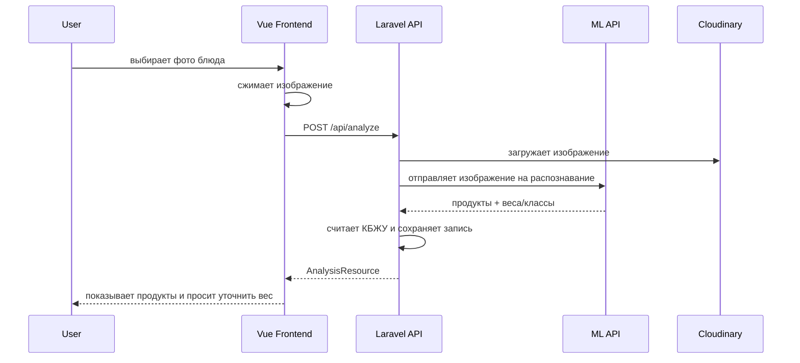

<div align="center">
  <h1>NutriVision Web</h1>

  <p>
    <strong>Laravel API + Vue frontend</strong> для AI-дневника питания.
  </p>

  <p>
    
    
    
    
  </p>
</div>

---

## 📌 Назначение

`web` — пользовательская часть NutriVision. Здесь находятся:

```text
web/
├── backend/     # Laravel REST API
└── frontend/    # Vue SPA
```

Backend отвечает за пользователей, токены, профиль, продукты, анализы питания и хранение изображений. Frontend отвечает за интерфейс дневника, загрузку фото, ручное добавление продуктов, редактирование порций и статистику.

---

## 🧭 Web-flow



---

## 🧱 Backend

### Технологии

- Laravel;
- Laravel Sanctum;
- Form Requests;
- API Resources;
- Policies;
- Services;
- Cloudinary для хранения изображений.

### Запуск backend

```bash
cd web/backend
composer install
cp .env.example .env
php artisan key:generate
php artisan migrate --seed
php artisan serve
```

### Важные `.env` параметры

```env
APP_NAME=NutriVision
APP_URL=http://localhost:8000
FRONTEND_URL=http://localhost:5173

DB_CONNECTION=mysql
DB_HOST=127.0.0.1
DB_PORT=3306
DB_DATABASE=nutrivision
DB_USERNAME=root
DB_PASSWORD=

CLOUDINARY_URL=cloudinary://...
ML_SERVICE_URL=http://localhost:8000
```

### Основные API-зоны

| Зона | Назначение |
|---|---|
| Auth | регистрация, вход, выход, текущий пользователь |
| Profile | параметры пользователя и дневные цели |
| Products | каталог продуктов |
| Analyses | дневник питания |
| Image Analysis | анализ фото блюда |
| Manual Analysis | ручное добавление продуктов |
| Health | проверка доступности API |

---

## 🎨 Frontend

### Технологии

- Vue 3;
- Vite;
- Pinia;
- Vue Router;
- Axios;
- composables-архитектура;
- светлая/тёмная тема.

### Запуск frontend

```bash
cd web/frontend
npm install
npm run dev
```

### Production build

```bash
npm run build
```

### Важные `.env` параметры frontend

```env
VITE_API_URL=http://localhost:8000/api
VITE_ML_URL=http://localhost:8000
```

---

## 🧩 Frontend-структура

```text
frontend/src/
├── api/                  # axios instance, auth events
├── components/
│   ├── auth/             # AuthCard, AuthFormAlert, AuthSubmitButton
│   ├── dashboard/        # dashboard UI components
│   ├── layout/           # AppHeader, AppFooter
│   ├── profile/          # ProfileForm, ProfilePreview
│   └── ui/               # IconResolver, ToastContainer
├── composables/          # бизнес-логика UI
├── constants/            # опции, типы приёмов пищи, auth constants
├── pages/                # route pages
├── router/               # route guards
├── services/             # API services
├── stores/               # Pinia stores
└── utils/                # форматирование, ошибки, расчёты
```

---

## 🧠 Ключевые frontend-composables

| Файл | Назначение |
|---|---|
| `useDashboardData.js` | загрузка анализов, группировка по приёмам пищи, дневные totals |
| `useImageAnalysis.js` | загрузка, preview, сжатие фото, pending-анализ |
| `useProductEditing.js` | редактирование продуктов и веса |
| `useManualEntry.js` | ручное добавление продуктов |
| `useAnalysisDelete.js` | удаление записей |
| `useTheme.js` | светлая/тёмная тема |
| `useAuthRedirect.js` | редирект авторизованного пользователя |
| `useServiceWarmup.js` | прогрев backend и ML-сервиса |

---

## 🔐 Авторизация и routing

Frontend использует token из `localStorage` и Pinia store.

Route guards:

- `requiresAuth` — страница доступна только авторизованным;
- `requiresProfile` — нужен заполненный профиль;
- `onlyIncompleteProfile` — `/profile-setup` доступен только пользователям без заполненного профиля;
- `guestOnly` — login/register только для гостей.

При `401` axios interceptor вызывает глобальный обработчик, очищает token и возвращает пользователя на `/login`.

---

## 🧪 Проверка

```bash
cd web/frontend
npm run build
```

```bash
cd web/backend
php artisan test
```

Ручной чек-лист:

- вход;
- регистрация;
- первичная настройка профиля;
- выход без задержки;
- открытие защищённых страниц без token;
- загрузка фото;
- ручное добавление записи;
- редактирование продуктов;
- удаление анализа;
- недельная статистика;
- переключение темы.

---

## 🧼 Production notes

- Старые локальные `/storage/...` изображения не используются во frontend.
- Новые изображения должны приходить через `analysis.image_url`.
- Для production рекомендуется Cloudinary или другой внешний storage.
- Если backend/ML размещены на бесплатном Render-тарифе, первый запрос может быть медленным — frontend показывает warm-up состояние.

---

<div align="center">
  <strong>NutriVision Web</strong><br />
  <span>Clean UI. Clear nutrition. AI-assisted tracking.</span>
</div>
